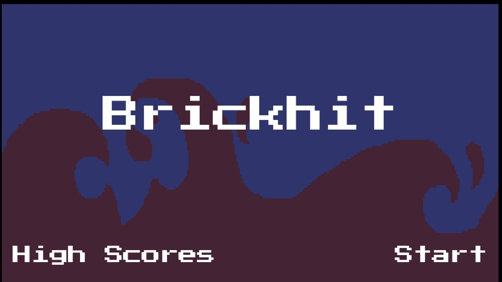
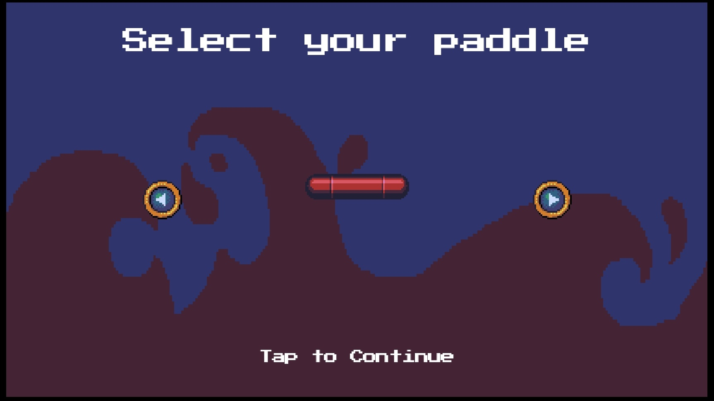
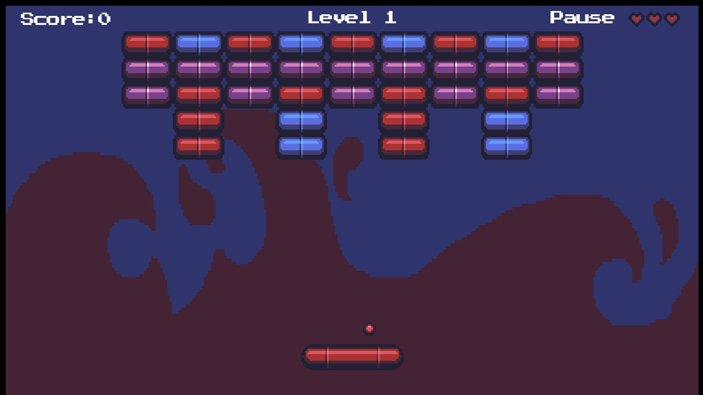
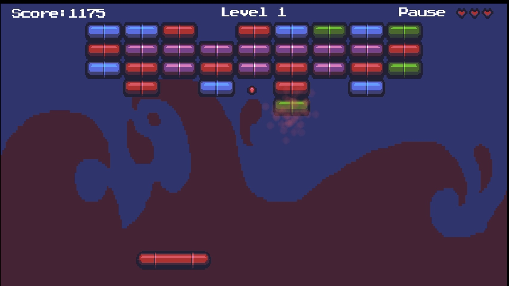
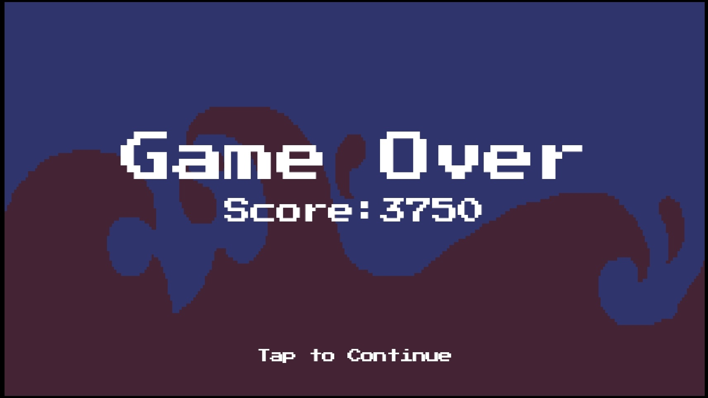
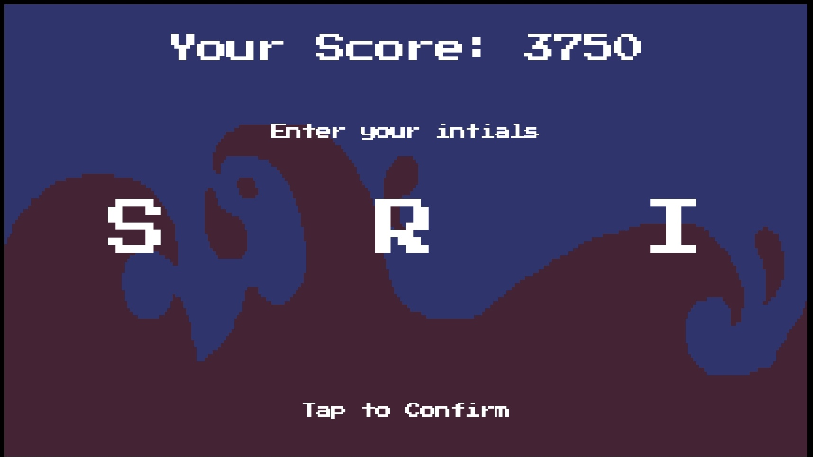
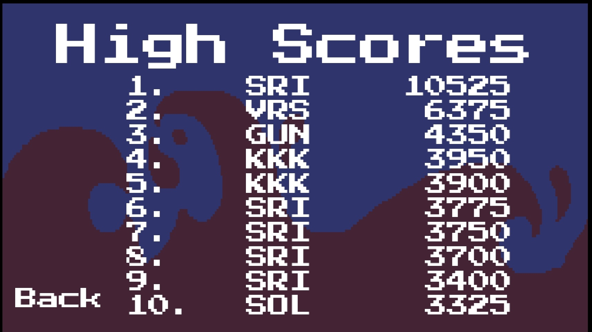

# BrickHit

A reimagining of Breakout (Atari, 1976) built as a learning project.

## About

Built following CS50's Introduction to Game Development course.
Break all the bricks using a ball and paddle across multiple levels
of increasing difficulty. Features particle effects, brick tiers,
paddle selection, and persistent high scores. Adapted entirely for
touch input on Android.

## How to Play

- Tap left half of bottom screen — move paddle left
- Tap right half of bottom screen — move paddle right
- Release finger — paddle stops
- Tap top left corner — pause
- Clear all bricks to advance to the next level
- Don't let the ball fall below the paddle

## Features

- Multiple levels with increasing difficulty
- 4 brick tiers — stronger bricks take more hits
- Particle effects on brick destruction
- Paddle skin selection
- Persistent high score leaderboard
- Enter your initials when you make the top 10

## Built With

- [LÖVE2D](https://love2d.org) — 2D game framework
- [Lua](https://lua.org) 5.4.8
- Built entirely on a OnePlus 6 Android phone using [Acode](https://play.google.com/store/apps/details?id=com.foxdebug.acodefree) editor

## Screenshots

## Download

Download the APK from the [Releases](https://github.com/srikanth9x/brickhit/releases/latest) page.

## Credits

- Course: [CS50 Game Development](https://cs50.harvard.edu/games) — Harvard University
- Instructor: [Colton Ogden](https://github.com/coltonoscopy)
- Assets: CS50 Game Development — [github.com/games50](https://github.com/games50)
- Original game concept: Breakout — Atari Inc. (1976)

## Disclaimer

This is an independent fan remake for educational purposes only.
Not affiliated with or endorsed by Atari Inc.

## License

MIT License — Copyright (c) 2026 [Bandari Srikanth](https://srikanth9x.pages.dev)